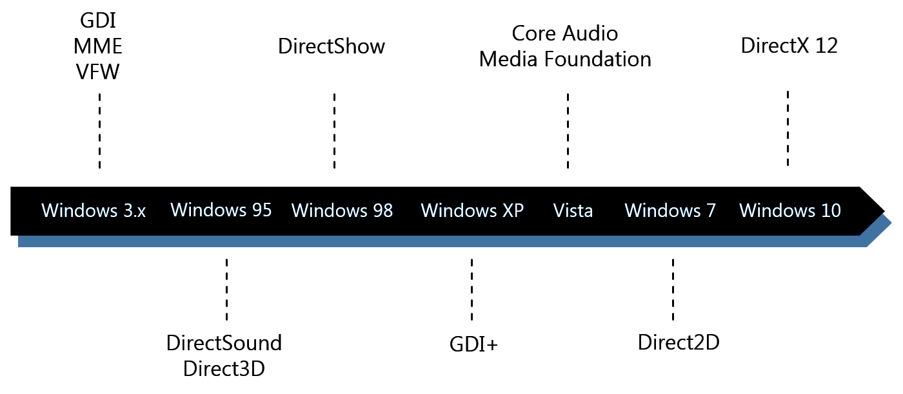
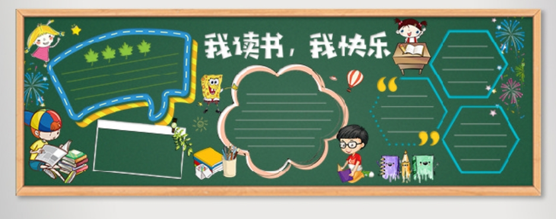
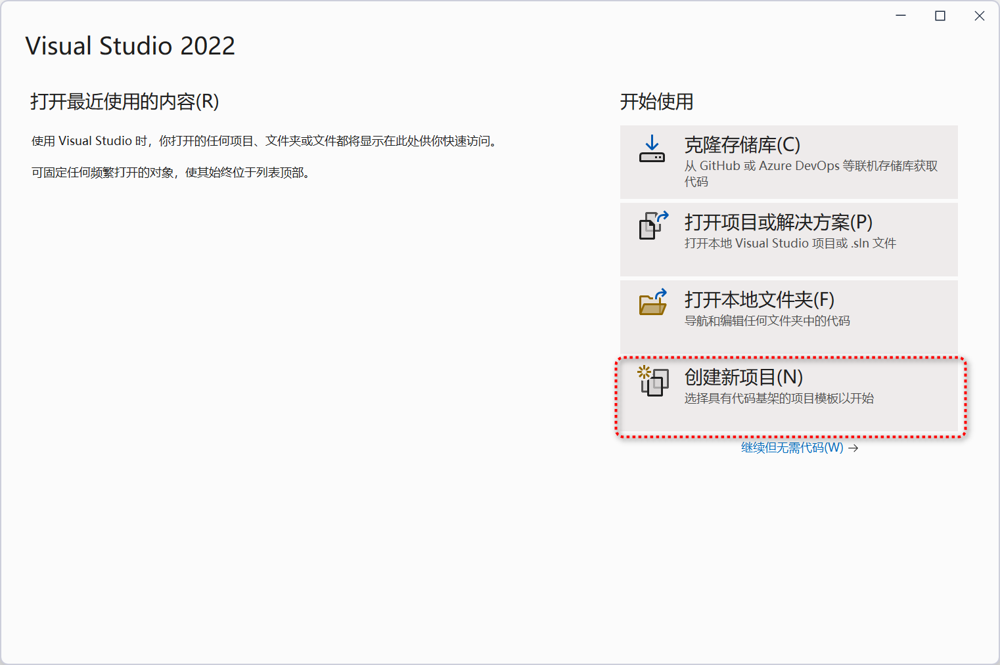
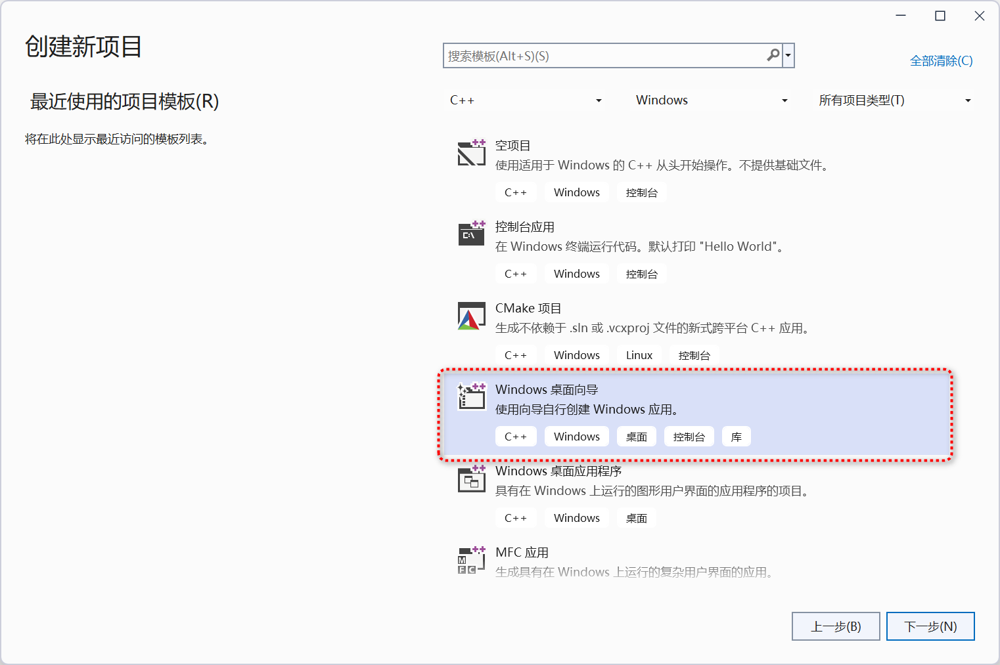
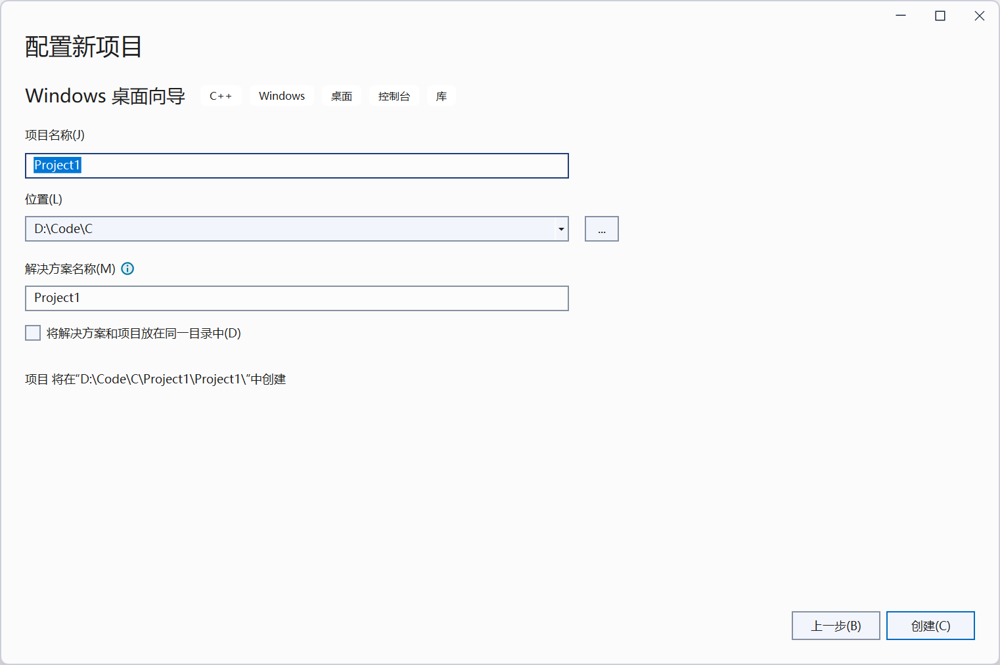
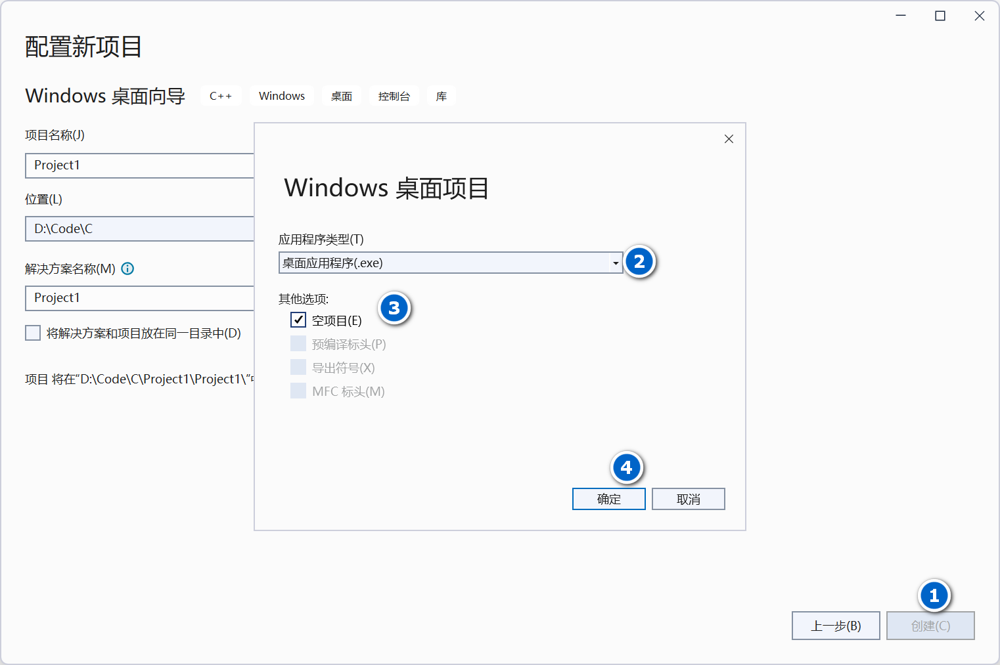
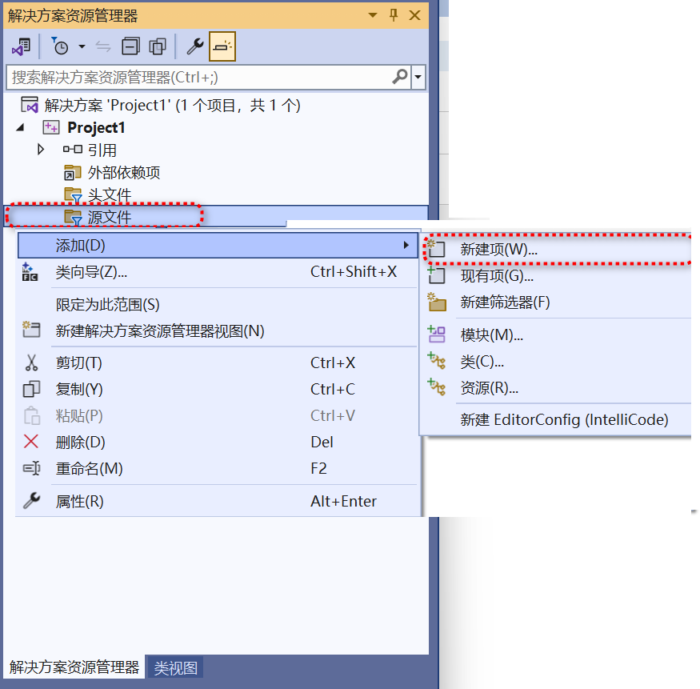
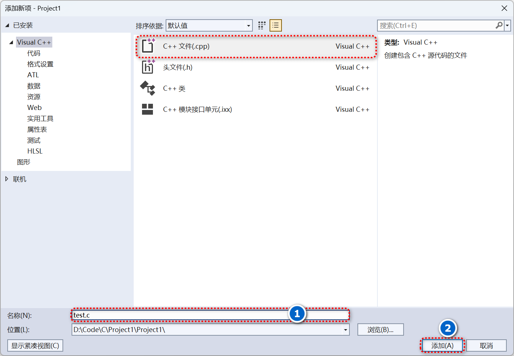
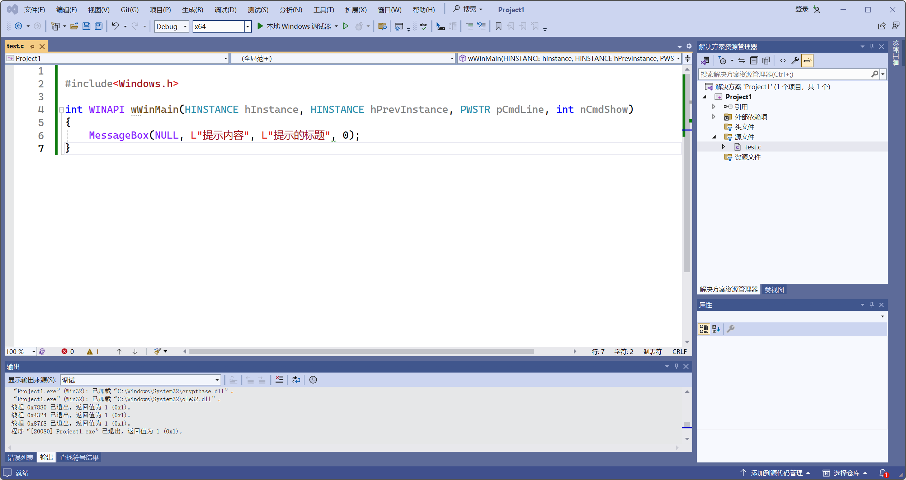
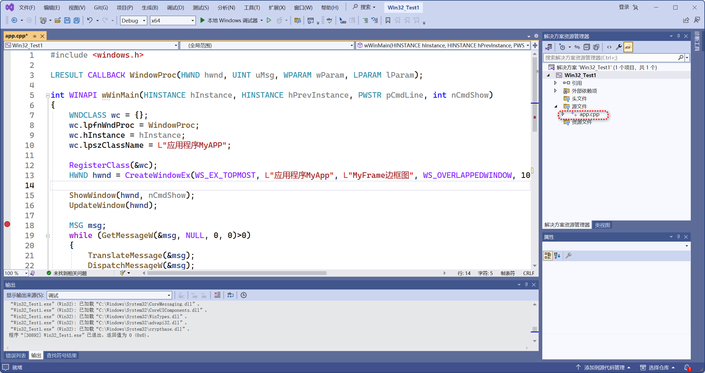

# Win32 编程基础

## 1.Windows GUI

1990 年 5 月 22 日，Windows 3.0 诞生了，微软帝国从此奠基，虽然没有和 Mac 一样精美的界面，但 Windows 兼容各个硬件厂家的框架才是它的致命武器。从 GDI 到 GDI+ 再到 Direct2D



GDI 

GDI 是 Graphics Device Interface 的缩写，含义是图形设备接口，它的主要任务是负责系统与绘图程序之间的信息交换，处理所有 Windows 程序的图形输出。 在 Windows 操作系统下，绝大多数具备图形界面的应用程序都离不开 GDI，我们利用 GDI 所提供的众多 API 就可以方便的在屏幕、打印机及其它输出设备上输出图形、文本等操作。 GDI 具有如下特点： 不允许程序直接访问物理显示硬件，通过称为“设备环境”的抽象接口间接访问显示硬件 程序需要与显示硬件（显示器、打印机等） 进行通讯时，必须首先获得与特定窗口相关联的设备环境 用户无需关心具体的物理设备类型 Windows 参考设备环境的数据结构完成数据的输出


GDI+ 

是 GDI 的后续版本，最早于 2000 年随 Windows 2000 一起推出，后来又被包装进 .NET 框架的托管类库中，成为 .NET 中窗体绘图的主要工具。 GDI+ 主要提供了以下三类服务: 二维矢量图形：GDI+ 提供了存储图形基元自身信息的类（或结构体）、存储图形基元绘制方式信息的类以及实际进行绘制的类； 图像处理：大多数图片都难以划定为直线和曲线的集合，无法使用二维矢量图形方式进行处理。因此，GDI+ 为我们提供了 Bitmap、Image 等类。它们可用于显示、操作和保存 BMP、JPG、GIF 等图像。 文字显示：GDI+ 支持使用各种字体、字号和样式来显示文本。 GDI 接口是基于函数的，而 GDI+ 是基于 C++ OO 的编程接口，因此使用起来比 GDI 要方便。因为 GDI+ 实际上是 GDI 的封装和扩展，所以执行效率一般要低于 GDI.


> GDI 的核心是设备上下文，GDI 函数都依赖于设备上下文句柄，其编程方式是基于句柄的；GDI+ 无需时刻依赖于句柄或设备上下文，用户只需创建一个 Graphics 对象，就可以用面向对象的方式调用其成员函数进行图形操作，编程方式是基于对象的。 GDI 在使用设备上下文绘制线条之前，必须先调用 SelectObject 以使钢笔对象和设备上下文关联。其后，在设备上下文中绘制的所有线条均使用该钢笔，直到选择另一支不同的钢笔为止。GDI 中有当前位置的概念，所以在使用 GDI 绘制线条前应该先使用MoveTo 移动当前位置，再使用 LineTo 画线。


Direct2D

Direct2D 是一个基于 Direct3D 的 2D 图形 API，可以利用硬件加速特性来提供高性能、高质量的 2D 渲染。而且十分方便的是，Direct2D 与 GDI，GDI+ 和 D3D 都是可以交互的。


## 2. Windows API

通常，Win32 是指WindowsAPI，也指 Microsoft Windows 操作系统的 32 位环境，和 Win64 Windows 常见环境。早期的操作系统为16位（window1.0），Win98/XP之后出现32位和64位，Win32即也是32位和64位的统称。

所谓Win32 编程，即主要使用GUI 构图，编写一套程序。除了使用原生的Window API，还有MFC框架。在Window视窗底层绘图中，微软系统仍保留了GDI，GDI+ 绘图支持，但新式的系统，微软更推荐使用DirectX（Direct2D 和 Direct3D）

假设有这样一种需求，你需要每周的班级的黑板报，大概流程思路是：

>  （1）设计定模板（选出风格）
>
> （2）指导员审核通过 
>
> （3）开始构图素描 
>
> （4）上色和填充内容 
>
> （5）向大家展示

由于需要经常出黑板报，为了简化工作，你大致把这种风格做成了常用的几个模板，以后每次黑板报只需先敲定版式，然后填字和上色内容



有了以上的初步概念，再转入Window API， 微软在提供接口函数（C语言）时，也基本类似这种流程。

## 3.Windows 环境搭建

- 安装Visual Studio 2022


- 启动Visual Studio 2022

  步骤1. 创建新项目

  

  步骤2. 选择Windows桌面向导（注意，不是控制台程序，而是桌面程序）

  

  步骤3. 给这个测试项目取个名字，这里选择默认的Project1

  

  步骤4. 在点击创建，并在应用程序类型下拉框中选择 ：桌面应用程序。 另外，勾选空项目，避免在学习初期过多的杂项内容影响

  

  步骤5. 在“源文件”的地方，鼠标右键，选择‘添加’ ，选择‘新建项’

  

  步骤6. 选择C++ 文件，文件名称可以是 test.c ,也可以是默认的 test.cpp (为了方便其他所有项目，后续统一为test.c)

  

  步骤7. 生成源文件后，双击选择，并在编辑内容，填写C代码。

  

  ```c
  #include<Windows.h>
  
  int WINAPI wWinMain(HINSTANCE hInstance, HINSTANCE hPrevInstance, PWSTR pCmdLine, int nCmdShow)
  {
  	MessageBox(NULL, L"提示内容", L"提示的标题", 0);
  }
  ```

  **代码解释：**

  1）windows.h 是一个最重要的包含文件，它囊括了若干其他 Windows 头文件，其中的某些头文件又包含另外的一些头文件。

   

  2）int WINAPI wWinMain，与普通的 int main 一致, 是函数的主入口， 其中WINAPI 函数一种约定，是函数的修饰符。

  另外值得一提的是， WinMain 有两个衍生版本的名字，分别对应两种编码。由于历史的积累，在编程过程中，可以发现很多类似的函数。对于新的操作系统和程序，官方也推荐统一使用UTF8编码，即建议以后只使用w开头或者w结尾的函数名

  w 也就代表了宽字符，方便程序的国际化。 字符串开头需要使用L来标识，如L"hello world"

  4个参数都是默认参数，所有程序都需要照写

   3）MessageBox 是系统提供的类（准确说，是windows.h 库文件中已有定义包含），因此不需要额外设计，可直接使用

​	

## 4.Windows API 初识

Windows API大致分为以下几个函数大块：

1. 基本服务
2. 组件服务
3. 用户界面服务
4. 图形多媒体服务
5. 消息和协作
6. 网络
7. web服务

### 4.1. Windows.h

重要的头文件，几乎包含所有API 函数： 

WinDef.h：基本数据类型定义 

WinBase.h：Kernel（内核）有关定义

 WinGdi.h：图形设备接口有关定义 

WinUser.h：用户界面有关定义 

### 4.2.入口函数

```c
wWinMain(
    _In_ HINSTANCE hInstance,
    _In_opt_ HINSTANCE hPrevInstance,
    _In_ LPWSTR lpCmdLine,
    _In_ int nShowCmd
    );
```

### 4.3. 设计一个Windows 窗口程序的基本步骤

1. 设计主程序

2. 窗口处理函数

3. 注册窗口类，向操作系统写入数据

4. 创建窗口 （在内存中创建窗口，开辟内存并绑定数据）
5. 显示窗口 （在显示器中绘制图像）
6. 消息循环 （获取，翻译，派发）
7. 消息处理

### 4.4.编写范例程序

```C

#include <windows.h>
 
LRESULT CALLBACK WindowProc(HWND hwnd, UINT uMsg, WPARAM wParam, LPARAM lParam);
 
int WINAPI wWinMain(HINSTANCE hInstance, HINSTANCE hPrevInstance, PWSTR pCmdLine, int nCmdShow)
{
    WNDCLASS wc = {};
    wc.lpfnWndProc = WindowProc;
    wc.hInstance = hInstance;
    wc.lpszClassName = L"应用程序MyAPP";
 
    RegisterClass(&wc);
    HWND hwnd = CreateWindowEx(WS_EX_TOPMOST, L"应用程序MyApp", L"MyFrame边框图", WS_OVERLAPPEDWINDOW, 100, 100, 800, 600, NULL, NULL, hInstance, NULL);
 
    ShowWindow(hwnd, nCmdShow);
    UpdateWindow(hwnd);
 
    MSG msg;
    while (GetMessageW(&msg, NULL, 0, 0)>0)
    {
        TranslateMessage(&msg);
        DispatchMessageW(&msg);
    }
 
}
LRESULT CALLBACK WindowProc(HWND hwnd, UINT uMsg, WPARAM wParam, LPARAM lParam)
{
    switch (uMsg)
    {
    case WM_DESTROY:
        PostQuitMessage(0);
        return 0;
    }
    return DefWindowProc(hwnd, uMsg, wParam, lParam);
}
```


### 4.5.Windows API 初次实验

按照之前4.4.的步骤，再创建一个新的项目，文件名称是 app.cpp (也可以是app.c),并将这个类取名为 MyApp，即最后运行的程序为MyAPP.exe


